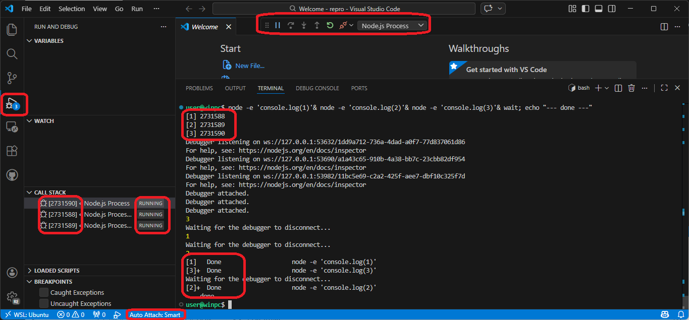
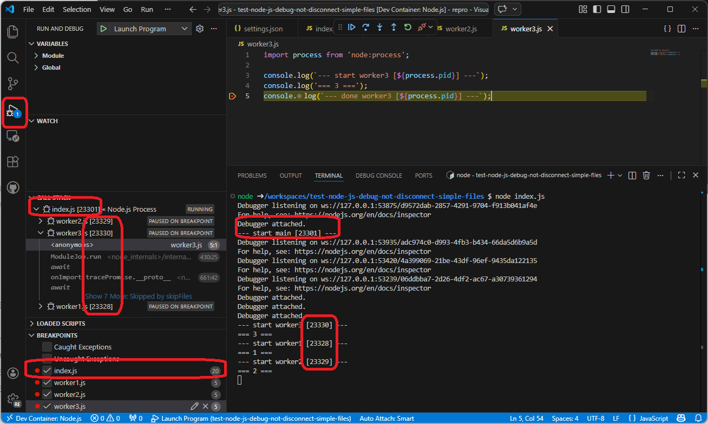
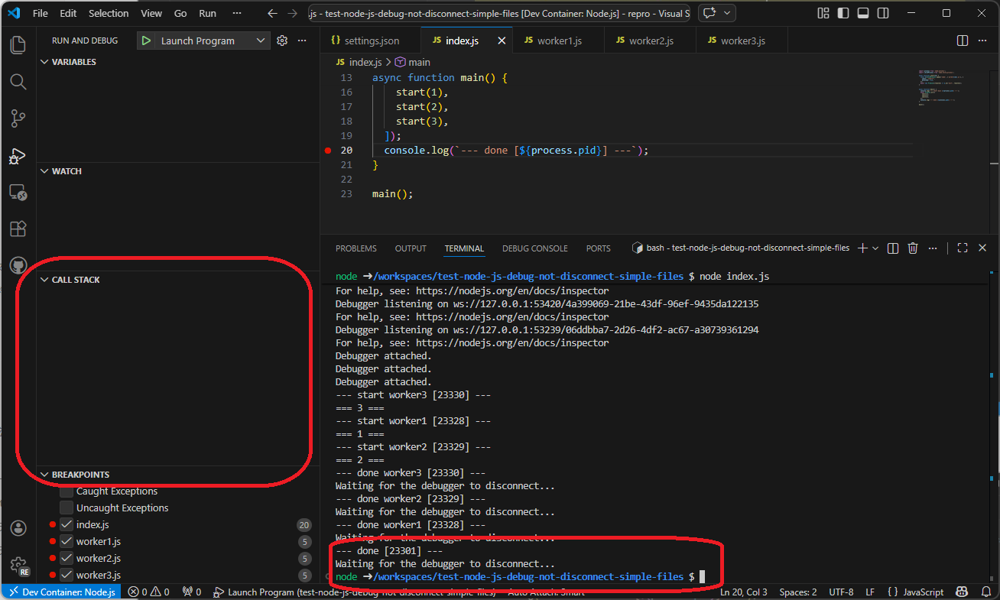
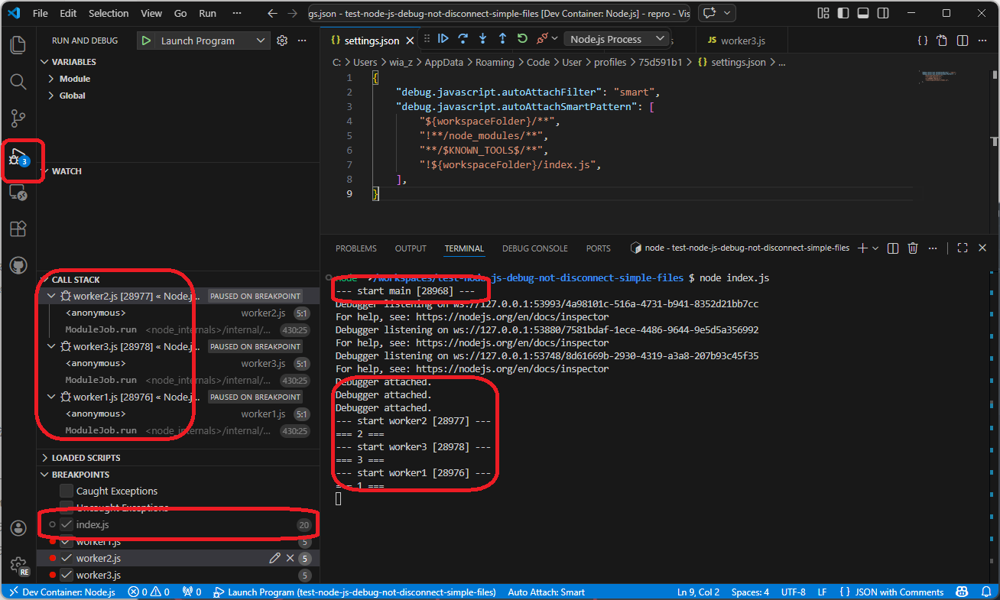
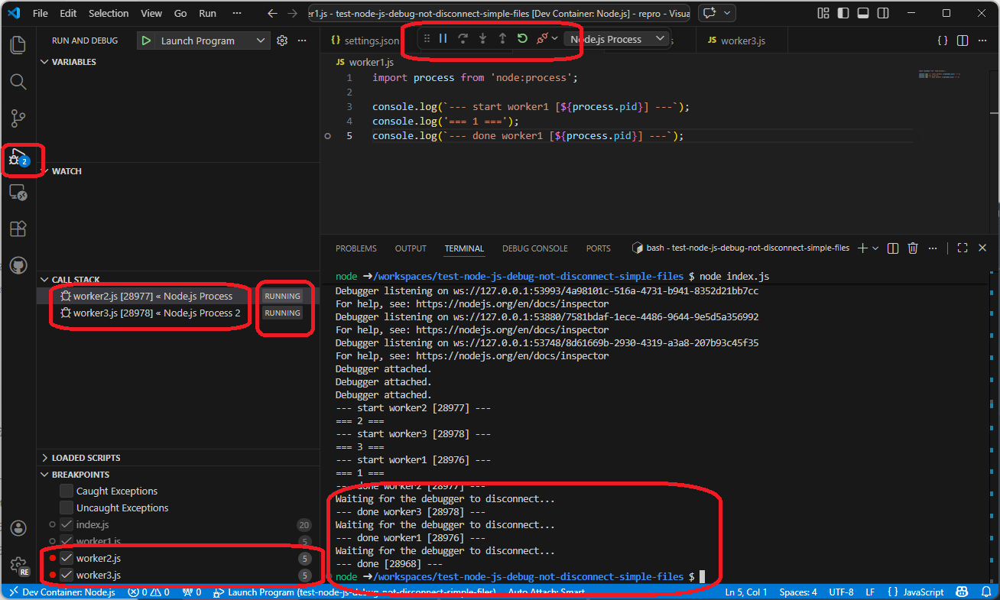

# test-node-js-debug-not-disconnect-simple-files


VS Code js-debug 拡張機能で複数セッションが同時に開始されると、セッションの切断が正常に行われないことがある。 

これは、再現手順用リポジトリ。


## 再現手順

1. Node.js が利用できる環境（WSL2 または Dev Container）でリポジトリを Clone。
2. VS Code の WSL 拡張機能で開く、または Dev Container として開く。
3. `Debug: Toggle Auto Attach` で `Smart`（または `Always`）を選択する。
4. integrated terminal を開く。
5. 以下を実行する。  
    ```
    node worker1.js& node worker2.js& node worker3.js& wait; echo '--- done ---'
    ```
6. 10 回程度繰り返す。



## 備考

- `Always` でも発生する。
- JavaScript Debug Terminal でも発生する。
- Dev Container でも発生する。
- Codespaces でも発生する(マシンタイプは 4 cores でないと再現しにくい、理由は不明)
  - Windows では 2 cores では発生しない、4 cores で発生する。
  - Ubuntu では 2 cores では発生しない、4 cores で発生する。
  - Chromebook + Linux では 2 cores でも発生する。

## 備考(プロセスツリー)

プロセスツリーに関する補足（再現しないケース） セッションの親プロセスが1つで、その親プロセスにデバッガーが接続している場合は再現されない。 この場合、デバッグセッション数のバッジは `1` となり、worker などは子プロセスとして接続される。すべての対象プロセスが終了するとセッションは正しく切断される。





一方で、`debug.javascript.autoAttachSmartPattern` で親プロセスを除外するなどして、worker 側にトップレベルとして複数セッションが同時に接続される状態（バッジが `3` になる状態）だと再現する（終了後も RUNNING が残ることがある）。

設定例（`index.js` を除外） 

```json
{
    "debug.javascript.autoAttachFilter": "smart",
    "debug.javascript.autoAttachSmartPattern": [
        "${workspaceFolder}/**",
        "!**/node_modules/**",
        "**/$KNOWN_TOOLS$/**",
        "!${workspaceFolder}/index.js",
    ],
}
```





実作業としては `node --test` で組み込みのテストランナー CLI を利用すると上記のような状態になる。テストランナー CLI 自体は(おそらく) Node.js の内部スクリプトとしてスキップされるためだと思われる。


## 環境

IDE
```
Version: 1.112.0 (user setup)
Commit: 07ff9d6178ede9a1bd12ad3399074d726ebe6e43
Date: 2026-03-17T18:09:23Z
Electron: 39.8.0
ElectronBuildId: 13470701
Chromium: 142.0.7444.265
Node.js: 22.22.0
V8: 14.2.231.22-electron.0
OS: Windows_NT x64 10.0.26200
```
